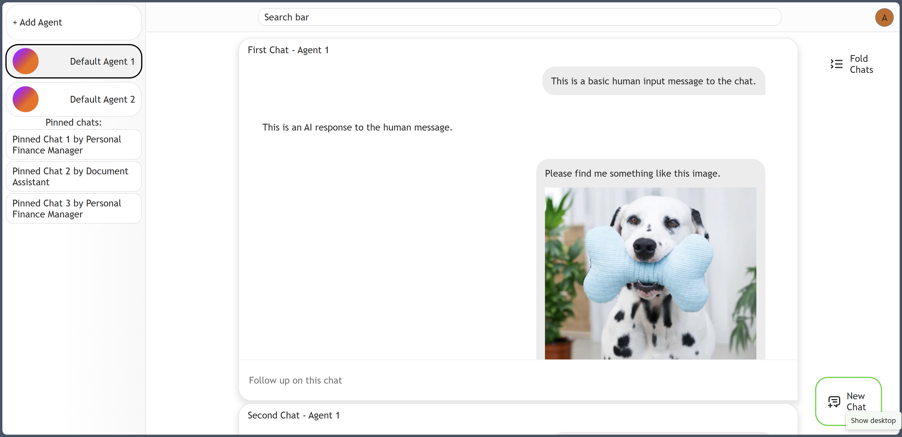

# 🧠 Pike - Personal Interactive Knowledge Exploration

**Pike** is an agentic platform for building and interacting with personalized AI agents. Users can create specialized agents tailored to unique knowledge domains and engage in dynamic conversations through a responsive web interface powered by a Python backend.

---

## 📸 Screenshot



---

## 🚀 Features

- Create and manage specialized AI agents
- Chat interface for personalized exploration
- Modular architecture with Python backend and modern JavaScript frontend
- Easy-to-use development and execution scripts

---

## 📁 Project Structure

```
pike/
│
├── frontend/ # Frontend application (npm-based)
├── backend/ # Backend application (Python-based, entry: pike.py)
├── setup.sh # Script to install dependencies and prepare environment
├── start.sh # Script to launch frontend and backend
├── .env # Environment file for API keys (you must create this)
└── README.md
```


---

## 🛠️ Setup Instructions

1. **Clone the repository** and enter the project directory.

2. **Create a `.env` file in the root** directory with the following content:

    ```env
    GOOGLE_API_KEY=your_api_key_here
    ```

    You can obtain your API key by following the instructions here:  
    [https://ai.google.dev/gemini-api/docs/api-key](https://ai.google.dev/gemini-api/docs/api-key)

3. **Run the setup script:**

    ```bash
    bash setup.sh
    ```

    This will:

    - Install Node.js using NVM
    - Install frontend dependencies
    - Create a Python virtual environment
    - Install Python backend dependencies

---

## ▶️ Running the Application

Once setup is complete, launch the platform using:

```bash
bash start.sh
```

This script will:

Start the backend server from backend/pike.py

Start the frontend development server from frontend/

Activate the Python virtual environment automatically

You can then access the platform in your browser at:

http://localhost:8080

## 🔧 Requirements

- Unix-like shell environment (Linux/macOS)
- Python 3.8+
- Bash
- Git
- curl

> The setup script will install Node.js via NVM if it's not already installed.

---

## 🧪 Development Tips

- To manually activate the backend environment:
  ```bash
  source backend/.venv/bin/activate
  ```


## 📃 License
This project is licensed under the MIT License.